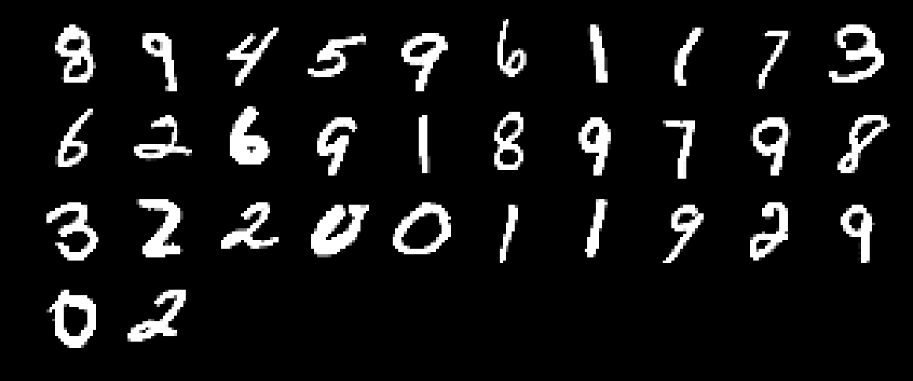
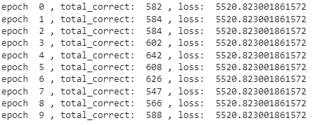

# EVA_8
## Data
The data is from the MNIST dataset, handwritten digit database.  
Below shows 32 images as a batch input ot the network.  
  
  
  
## Data generation strategy:
* image data is prepared in a batch number 32.  
* use torch.randint(0, 10, (1,)) to generate a random interger from 0 to 9, then convert it to OneHout tensor as the second data
  
## Network
The network takes two input:  
1.   Image, handwritten digit from MNIST  
2.   Tensor of random interger
  
To combined the two inputs in the network:  
Firs, image is run through layers with Conv2d, relu, and maxpool2d, to predict the label of handwritten digit.  
Second, the previous ouput was unsqueeze in (dim=1), then concatenate with the random number as one-hot tensor.  
  
The final output contain the image label prediction and softmax output of the two number sum.

## Result  
As we can see the figure below, the training logs, the training was not improving the accuracy. Loss has no significant change. Since sum of image label with the random number has no chance to be predict by this network structure. The chance is only 1/19.
  
  
